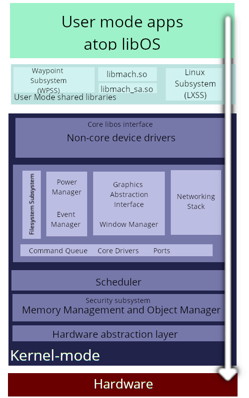

# FERAL KERNEL

## What is Feral?
Feral is a monolithic kernel, just as a small hobby project to build a complete
operating system from scratch, even if that's very slowly.

Feral is designed to run on recent PC systems with a reasonably compatible BIOS.
For now, Feral does not support UEFI, although a port is in progress.

## Supported Hardware

Feral, for now, assumes the presence of the two 8259A PICs present in traditional
PC-compatible microcomputers. On modern micros, your southbridge, such as x399 or x470,
probably has something compatible. In the future, Feral intends to move on to
utilization of newer processor features, such as the APIC, and eventually the 
xAPIC and x2APIC. In addition, Feral will support symmetric multiprocessing.

Currently, hardware being tested includes a PC with a 4"x4" motherboard and an N3700 CPU ("Braswell") with 4GB of RAM,
a 17z laptop with a 2500U (aforementioned Zen 1), and in the future, an x5-Z8350 with 2GB of RAM ("Cherry Trail").

In the future, Feral is intended to run on Aarch64 (BCM2711), POWER (Sforza), and RV64GC (U540) hardware,
with ports written somewhere in that order.

## Core architecture?
Architecturally, Feral is a simple monolithic kernel, which architecturally shares
many similaries with Mach and Plan 9, especially the latter. Feral prefers to place
most functionality into drivers, rather than directly baked into the kernel itself, 
to allow for more flexibility, and to expose resources as a network location and socket, to
better reflect how modern processes and storage work.

For example, to open a file, one queries the file server, which is a process
owned by the kernel, which opens a socket which accepts incoming traffic.
It can then be read from, or written to, depending on how the socket was
opened.

## Why Feral?

Feral is created for me to learn more about operating systems design, while departing
from the traditional "make another *NIX clone" way of doing this: there's nothing 
wrong with that, but I'd like to explore different ways of exposing hardware and
system features to programs besides just making a file somewhere. In addition,
I'd like to explore just how different a new OS can be from traditional systems
while being easy to port existing software to.

While this image is outdated, since some of these subsystems should get absorbed
into the kernel, for the most part this is accurate to the intention:


## Building?
Feral now uses CMake to build.
A utility script is included for the common case of building
for x86_64 and QEMU in `vm_test.sh`, and with the GDB stub enabled in `vm_test_gdb.sh`.

For manually building, you must use Clang as your C compiler. There are currently
no toolchain files to support building for different architectures, but they
will be present in a yet-to-be-made `cmake/` directory.

The kernel proper can be built with simply
```
mkdir build
cd build
cmake .. -DCMAKE_C_COMPILER=clang
make -j`nproc`
```
as a file called `FERALKER`.

## Minimum requirements?
Feral should run comfortably on any PC implementing the x86-64 instruction set
(ie, at least K8 CPU), and at least 1GB of system memory.
This memory requirement will be lowered in the future, but for now is required
to make things a little easier when setting up the kernel initially.

Feral expects a VGA-compatible display adapter to be present for a PC. As such,
you'll need some form of video adapter capable of running in VGA mode. Most
consumer-class CPUs and GPUs implement this in at least one of their GPUs.

Currently, Feral is tested exclusively on virtual machines on top of Zen 1 1950X,
and a handful of smaller Zen 1 machines. It is probable Feral will run fine on
other hardware, but it is not tested.

## Is there any naming convention?
Folders should be named in a way to avoid unnecessary characters (ie, 'inc' vs 'include'.)
Likewise, for a given module, the folder name should reflect the prefix, such that
memory management is in "mm", and object management is in "ob", and so on.

Functions thaat should be exported between modules should generally have the
naming convention of (SUBSYSTEM)(FUNCTION-PURPOSE)(OPTIONAL-ARGUMENT-TYPE),
such as "KeStartProcessor". When the function is architecture-specific, then
it should be prefixed with the architecture it belongs to, such as 
"aarch64StartPaging()", or "x86SetupIDT()". For more details, see Formatting.txt

In addition, functions should use the macros IN, INOUT, OPT, etc. to clearly
identify what a function does with an argument. These macros expand to nothing,
and are only there to help in documentation.

## Overall goals:
 - Lightweight core kernel. Majority of functionality in drivers. Processes communiate to libos (syscalls go to a kernel table which tells a libos driver that this was called.)
 
 - Much more clear, explicit kernel operations. Eliminate guessing--the kernel is *VERY* clear about exactly what it will do.

 - Drivers handle system calls to allow running "foreign" programs unmodified, such as the GNU Mach version of GCC, or everyone's favorite DOS game set on Mars.

 - Stable, internal kernel ABI. Third party drivers should work across minor revisions. Use the pNext pointer for any serious changes.

 - Stable, versioning filesystem included, such that an accidental `deltree` doesn't delete everything forever. Assume the user makes no backups.

 - (Eventually) create fully Vulkan compliant drivers for the "Vega" and "Navi" family of GPUs.

 - Support x86-64 virtualization extensions ("Pacifica").
 
 - Something like a chroot jail or containers, to allow Feral to be useful for server operations.

 - Something fun to work on that might be useful one day?